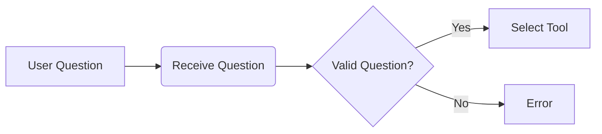
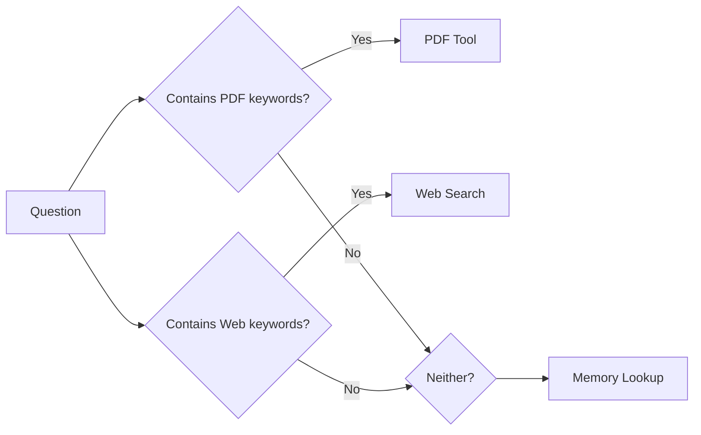
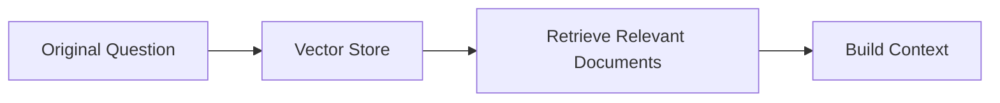

# Research Assistant with LangGraph & LangChain

## Overview
This Research Assistant is an AI-powered tool that helps you find answers to complex questions by intelligently combining web search, PDF analysis, and memory recall. Built with LangGraph for workflow orchestration and LangChain for AI components, it demonstrates how to build sophisticated AI applications.

## Key Features
- **Intelligent Question Routing**: Automatically selects the best tool for each question
- **Web Search**: Finds up-to-date information using Brave Search API
- **PDF Analysis**: Summarizes content from PDF documents
- **Memory Recall**: Remembers past conversations for context
- **Citation Generation**: Provides sources for all information
- **Modular Architecture**: Easy to extend and maintain

## Tools & Technologies
### Core Frameworks
1. **LangGraph**: 
   - A library for building stateful, multi-actor applications with LLMs
   - Manages complex workflows with conditional routing
   - Handles state transitions between different tools

2. **LangChain**: 
   - Framework for developing applications powered by language models
   - Provides components for working with LLMs, embeddings, and vector stores
   - Enables chaining of AI operations

### Supporting Technologies
- **ChromaDB**: Lightweight vector database for storing document embeddings
- **Sentence Transformers**: Creates embeddings for text similarity search
- **OpenAI API**: Powers the AI responses using GPT models
- **Brave Search API**: Provides web search results
- **PyPDF2**: Extracts text from PDF documents

## How It Works - Step by Step

### 1. Question Reception


- The system receives a user question
- Validates the question isn't empty
- Logs the question for debugging

### 2. Tool Selection


- Analyzes question content to choose the best tool:
  - **PDF Tool**: For questions about documents (e.g., "summarize this PDF")
  - **Web Search**: For current information requests (e.g., "latest AI news")
  - **Memory Lookup**: For follow-up questions (e.g., "what did we discuss earlier?")

### 3. Tool Execution

#### Web Search
1. Queries Brave Search API
2. Retrieves top 5 results
3. Stores results in ChromaDB vector store
4. Returns search snippets

#### PDF Processing
1. Extracts PDF URL from question
2. Downloads and processes the PDF
3. Splits text into manageable chunks
4. Stores chunks in ChromaDB
5. Generates summary using OpenAI

#### Memory Lookup
1. Searches previous conversations
2. Uses simple word-matching algorithm
3. Returns relevant past Q&A pairs

### 4. Context Enrichment (RAG)


- Retrieves additional context using RAG (Retrieval-Augmented Generation)
- Queries ChromaDB for documents similar to the question
- Combines search results with RAG documents
- Includes relevant memory context

### 5. Answer Generation
1. Constructs comprehensive prompt with:
   - Original question
   - Search results
   - RAG documents
   - Memory context
2. Sends prompt to OpenAI API
3. Requests well-cited, comprehensive answer
4. Extracts citations from sources

### 6. Memory Storage
1. Stores successful Q&A pairs
2. Saves to JSON file
3. Includes citations
4. Timestamps entries for future reference

## Setup & Installation

### Prerequisites
- Python 3.9+
- OpenAI API key
- Brave Search API key

### Installation Steps
1. Clone repository:
   ```bash
   git clone https://github.com/prodigy-geness/research-assistant.git
   cd research-assistant
   ```

2. Create virtual environment:
   ```bash
   python -m venv venv
   source venv/bin/activate  # Linux/Mac
   venv\Scripts\activate    # Windows
   ```

3. Install dependencies:
   ```bash
   pip install -r requirements.txt
   ```

4. Create `.env` file:
   ```env
   OPENAI_API_KEY=your_openai_api_key
   BRAVE_API_KEY=your_brave_api_key
   ```

5. Run the application:
   ```bash
   python main.py
   ```

## Project Structure
```
research-assistant/
├── .env                    # Environment variables
├── main.py                 # Entry point
├── config.py               # Configuration settings
├── state.py                # State definitions
├── utils.py                # Utility functions
│
├── api/                    # API integrations
│   ├── brave_search.py     # Brave Search API
│   ├── openai_api.py       # OpenAI API
│   └── pdf_processor.py    # PDF processing
│
├── graph/                  # Workflow components
│   ├── nodes.py            # Individual processing steps
│   └── workflow.py         # Workflow orchestration
│
└── stores/                 # Data storage
    ├── memory_store.py     # Conversation memory
    └── vector_store.py     # Vector database
```

## How to Use
1. Start the application:
   ```bash
   python main.py
   ```

2. Ask questions in natural language:
   - "What are the latest developments in AI?"
   - "Summarize this PDF: https://example.com/document.pdf"
   - "What did we discuss about Python earlier?"

3. The assistant will:
   - Process your question
   - Select appropriate tools
   - Gather information
   - Generate comprehensive answer
   - Provide citations

## Key Concepts Explained

### LangGraph
LangGraph enables building complex workflows where:
- Each step is a "node" in a graph
- Nodes pass "state" between each other
- Conditional "edges" route between nodes
- Handles cycles and state management

In our research assistant:
- Nodes are processing steps (search, RAG, etc.)
- Edges connect nodes based on conditions
- State maintains question context throughout

### Vector Databases (ChromaDB)
- Store documents as numerical vectors (embeddings)
- Enable similarity search: "Find documents like this query"
- Used for:
  - Storing web search results
  - Storing PDF content chunks
  - Powering RAG context retrieval

### RAG (Retrieval-Augmented Generation)
Combines:
1. **Retrieval**: Find relevant documents
2. **Augmentation**: Add documents to prompt
3. **Generation**: Create answer using context

Benefits:
- More accurate than LLMs alone
- Provides citations
- Can use up-to-date information

### Memory Systems
Our assistant remembers conversations using:
- Simple JSON storage
- Word-based relevance scoring
- Timestamped entries
- Automatic saving after each interaction

## Future Improvements
1. Add more tools (database queries, API integrations)
2. Implement more sophisticated memory using vector similarity
3. Add user authentication for personalized memory
4. Implement rate limiting for APIs
5. Add web interface for easier interaction
6. Support more document types (Word, PowerPoint, etc.)

## Troubleshooting
**Problem**: ChromaDB collection errors  
**Solution**: Delete the `chroma_db` directory and restart

**Problem**: Missing API keys  
**Solution**: Verify `.env` file contains valid keys

**Problem**: PDF extraction fails  
**Solution**: Check URL validity and PDF accessibility

**Problem**: Low-quality answers  
**Solution**: Try switching to GPT-4 in `config.py`

## License
This project is licensed under the MIT License - see the [LICENSE](LICENSE) file for details.

## Resources
- [LangGraph Documentation](https://langchain-ai.github.io/langgraph/)
- [LangChain Documentation](https://python.langchain.com/)
- [ChromaDB Documentation](https://docs.trychroma.com/)
- [OpenAI API Docs](https://platform.openai.com/docs)
- [Brave Search API Docs](https://brave.com/search/api/)

This README provides a comprehensive overview of the Research Assistant project, explaining both the technical implementation and conceptual foundations in a beginner-friendly manner. The modular architecture makes it easy to extend with new tools and capabilities as needed.